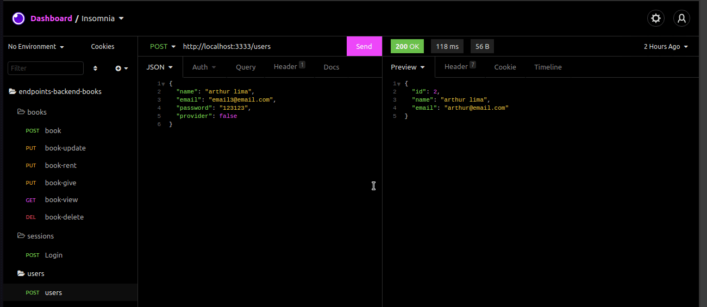
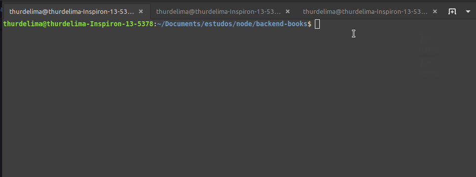

# 📚 Api of Books

##  💡 About project:
Api created by node with unit test in jest. Create users and books for give and rent.


Import file called endpoints_collection_backend_books.json in your insomnia or postman.

<div align="center" >
  
</div>


## Run Test

Clone the project

```bash
 yarn test
```

<div align="center" >
  
</div>


## Run Locally

Clone the project

```bash
  git clone https://github.com/thurdelima/node-jest-api-books
```

Go to the project directory

```bash
  cd node-jest-api-books
```

Install dependencies

```bash
  yarn install or yarn
```

Configure .ENV vars


Run migration

```bash
  npx sequelize-cli db:migrate

```

And

```bash
  yarn start

```


<br/>

<h4 align="center">
  

Made with ♥   by Arthur Lima :wave: [Get in touch!](https://www.linkedin.com/in/arthur-lima-294ab0103/)
</h4>

